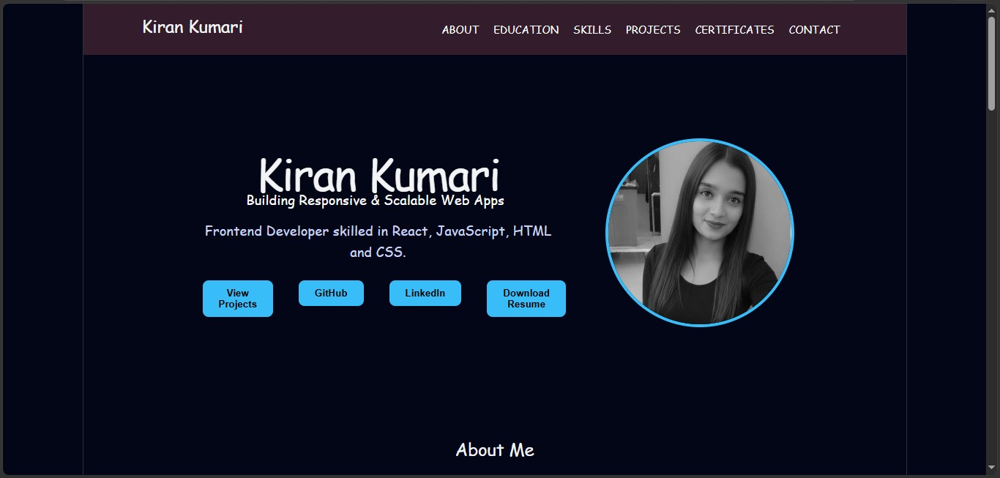
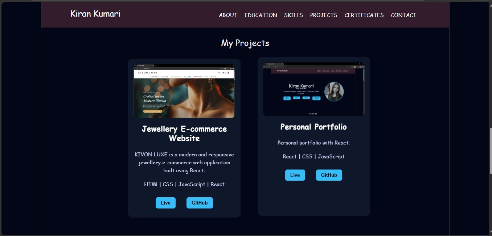
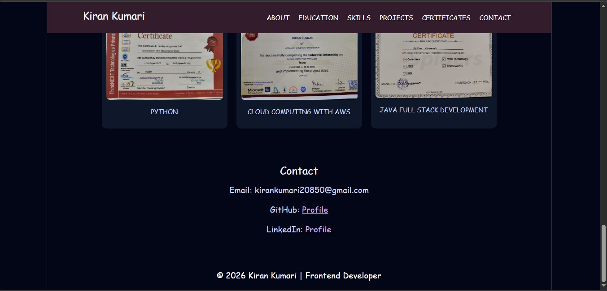

“Actively looking for Frontend Developer opportunities”
# 🌐 Kiran Portfolio

## 🚀 Live Demo

🔗 [View Portfolio](https://your-portfolio-link.vercel.app)

---

## 📌 About The Project

This is my personal portfolio website built to showcase my skills, projects, and achievements as a **Frontend Developer**.

It includes sections like About, Skills, Projects, Certificates, and Contact.

---

## 🛠️ Tech Stack

* HTML
* CSS
* JavaScript
* React.js
* Vite

---

## ✨ Features

* Responsive Design (Mobile + Desktop)
* Smooth Scrolling
* Modern UI/UX
* Project Showcase with Live Links
* Resume Download Option

---

## 📂 Project Structure

src/
├── components/
├── pages/
├── assets/
└── styles/

---

## 📸 Screenshots

### 🏠 Home Page

### 💼 Projects Section

### 📞 Contact Section

---

## 📞 Contact

* 📧 Email: kirankumari20850@gmail.com
* 💼 LinkedIn: https://www.linkedin.com/in/kiran-kumari-b81b941bb/
* 💻 GitHub: https://github.com/kiku5858

---

## 🙋‍♀️ Author

**Kiran Kumari**

---

## ⭐ If you like this project

Give it a star ⭐ on GitHub!
